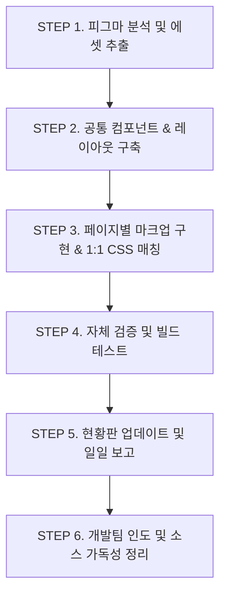

# RMHC Korea 퍼블리싱 전체 페이지 완료 마스터 플랜

본 문서는 RMHC Korea 홈페이지 개편 마크업 프로젝트에서 정의된 50개 전체 페이지(IA 목록)를 안정적으로 완료하기 위한 업계 표준 퍼블리싱 프로세스, 공통화 및 최적화 전략을 기술한 마스터 플랜입니다.

---

## 1. 🏗️ 프로젝트 프로세스 (업계 표준 개발 수순)

전체 퍼블리싱 작업은 다음 6단계의 엄격한 프로세스에 따라 진행됩니다.

### 1단계: 피그마 분석 및 에셋 추출 (임의 추측 방지)

- 피그마 개발자 모드(Dev Mode)를 활용하여 정밀 수치(Margin, Padding, Font-size, Line-height)를 추출합니다.
- 피그마 내에 깨진 이미지, 불투명한 아이콘, 또는 CSS로 표현할 수 없는 그래픽 요소가 있을 경우 **임의로 추측하여 대체하지 않고**, 즉시 사용자에게 고해상도 시안 이미지나 원본 SVG/PNG 에셋을 요구하여 적용합니다.

### 2단계: 공통 컴포넌트 & 레이아웃 구축 (공통화)

- **HTML 조각화**: 헤더([header.html](file:///d:/rmhc/front//includes/header.html)), 푸터([footer.html](file:///d:/rmhc/front//includes/footer.html)) 및 레이어 팝업([popups/](file:///d:/rmhc/front//includes/popups/))을 모듈화하여 공통 관리합니다.
- **CSS 컴포넌트화**: 버튼([button.css](file:///d:/rmhc/front/src/css/components/button.css))과 폼 컨트롤([form.css](file:///d:/rmhc/front/src/css/components/form.css)) 등 공통 UI 요소를 독립된 CSS 파일로 분리하고, [style.css](file:///d:/rmhc/front/src/css/style.css)에 `@import` 연동합니다.

### 3단계: 페이지별 마크업 구현 및 1:1 CSS 매칭 (구조화)

- **IA 준수 독립 파일 구성**: 기획 IA(50개 페이지)의 경로 규칙에 따라 HTML 및 1:1 매칭되는 개별 CSS 파일을 순차적으로 마크업합니다.
- **검증용 보일러플레이트 적용**: 신규 페이지 생성 시 글로벌 레이아웃 조각 로드 마크업을 기본 이식하여 마크업의 통일성을 보장합니다.

### 4단계: 자체 검증 및 빌드 테스트 (안정성)

- **HTMLHint 검증**: `npm run lint:html`을 실행하여 태그 누락, 속성값 따옴표 누락 등 마크업 유효성을 상시 검증합니다.
- **정적 빌드 검증**: `npm run build`를 구동하여 Vite 환경에서 HTML 조각 로딩 및 PostCSS 컴파일에 오류가 없는지 1차 빌드 테스트를 수행합니다.
- **PageSpeed & 접근성 체크**: 폰트 `swap` 적용 여부, 터치 영역(`48px`), 색상 대비(옐로우 배경 위에 차콜 블랙 글자), 모바일 인풋 폰트 크기(`16px` 이상), 이미지 종횡비 지정(CLS 방지)을 기계적으로 확인합니다.

### 5단계: 현황판 업데이트 및 일일 보고 (투명성)

- 작업이 완료되거나 상태가 변경(진행 ➡️ 완료, 수정 등)된 페이지는 [publishing-ia.json](file:///d:/rmhc/front/src/js/publishing-ia.json)에 기록하여 [index_ia.html](file:///d:/rmhc/front/index_ia.html) 현황판에 실시간 반영합니다.
- 하루 일과 종료 전, [docs/업무일지/](file:///d:/rmhc/front/docs/업무일지) 경로에 당일 변경 사항 및 진행율을 작성하여 커밋합니다.

### 6단계: 개발팀 인도 및 소스 가독성 정리 (품질 보증)

- 향후 Thymeleaf/React 등 템플릿 엔진으로의 원활한 변환을 고려하여, 가독성 높은 들여쓰기(Indent) 및 구역별 명확한 HTML 주석(`<!-- S: Menu --> ... <!-- E: Menu -->`)을 삽입합니다.

---

## 2. 🧩 공통화 및 최적화 전략 상세

### 1) 마크업 및 디자인 공통화

- **인클루드 컴포넌트화**:
  - 자원봉사 신청 팝업, 기부 수단 변경 팝업 등 공통 팝업 요소를 `/includes/popups/`에 독립 파일로 생성하여 필요한 페이지에 유연하게 로드합니다.
- **디자인 토큰 재사용**:
  - `src/css/style.css` 내에 정의된 CSS 변수(예: `--primary`, `--secondary`, `--radius-md`, `--spacing-4` 등)만을 사용하여 디자인 통일성을 보장하고, 하드코딩된 색상값이나 마진값을 배제합니다.

### 2) 성능 및 모바일 접근성 최적화

- **CLS (Cumulative Layout Shift) 예방**:
  - 모든 이미지 태그(``)에 실제 종횡비 비율에 맞춘 `width`와 `height` 값을 상수로 선언합니다.
- **LCP (Largest Contentful Paint) 최적화**:
  - 각 페이지의 최상단 주요 배너나 키비주얼 이미지에는 `fetchpriority="high"` 속성을 부여해 초기 로딩을 극대화합니다.
- **접근성 및 폼 최적화**:
  - 모바일 환경에서 입력 시 자동 줌인 현상을 방지하도록 모바일 뷰포트 내 모든 입력 필드(`input`, `textarea`)의 기본 폰트 크기를 최소 `16px (1rem)` 이상으로 일관되게 규격화합니다.
  - 선택 및 터치가 필요한 액션 타깃의 클릭 영역 크기를 최소 `48px` 이상 확보합니다.

---

## 3. 🎯 피그마 싱크 & 에셋 수집 프로토콜

- **피그마 100% 동일성 확보**:
  - 시안에 정의된 그리드 레이아웃과 폰트 스타일, 컬러셋을 절대적으로 준수하며, 임의로 변형하지 않습니다.
- **피그마 판독 불가 시 시안 이미지 요청 규칙**:
  - 피그마의 Dev Mode 접근이 불가능하거나 특정 레이어가 깨져 수치/이미지를 정확히 식별할 수 없는 경우, **추측하여 임의로 퍼블리싱하지 않고 사용자에게 고해상도 시안 이미지(각 해상도별 레이아웃 스크린샷) 및 그래픽 원본 에셋 파일을 즉시 공식 요청**합니다.
  - 사용자의 회신이 완료되기 전까지는 해당 페이지의 마크업 뼈대 설계만 진행하고, 디자인 상세 마크업은 홀딩하여 추후 재작업의 리스크를 방지합니다.

---

## 🚀 4. 퍼블리싱 수행 일정 및 마일스톤

기획 IA 50개 페이지 및 팝업/컴포넌트의 완성도 높은 진행을 위해 다음과 같은 단계별 마일스톤을 제안합니다.

| 단계                      | 대상 화면군                             | 주요 공통화 및 최적화 핵심                                             |
| :------------------------ | :-------------------------------------- | :--------------------------------------------------------------------- |
| **1단계: 기초 정비**      | 글로벌 레이아웃, 공통 팝업 뼈대         | header, footer, 기본 딤드 팝업 레이아웃 완성                           |
| **2단계: 회원/로그인**    | 로그인, 회원가입, 비밀번호/아이디 찾기  | 폼 유효성 에러 문구(`error-text`) 마크업 및 CSS 공통화                 |
| **3단계: 후원/자원봉사**  | 일시/정기후원, 완료, 자원봉사 신청      | 금액별 동적 필드 노출 아코디언, 주민등록번호 수집 UI 모듈화            |
| **4단계: 소개/하우스**    | 재단소개(5종), RMHC 하우스(5종)         | LCP 이미지 최적화, 표/연혁 테이블 크로스브라우징 대응                  |
| **5단계: 마이페이지**     | 마이페이지 메인, 후원이력, 기부금영수증 | 마이페이지 비밀번호 재검증 화면, 탭(Tab) 전환 UI 및 Empty State 공통화 |
| **6단계: 뉴스/정책/기타** | 공지사항, 활동소식, 약관/정책(3종)      | 게시판 리스트/상세 반응형 테이블 최적화, 정책 텍스트 가독성 최적화     |

---

## 📂 5. Figma 추출 복잡 에셋 마이그레이션 및 정형화 플랜

현재 `src/assets/` 디렉토리에 피그마 노드 ID가 포함되어 수집된 기하학적 명칭의 임시 에셋 파일(약 600여 개)이 보관되어 있습니다.
코드 가독성 향상과 인도 품질 확보를 위해 본 에셋들을 아래 기준에 따라 정형화하여 **`src/images/` 경로로 리네이밍 및 마이그레이션**하여 활용합니다.

### 1) 마이그레이션 및 분류 표준

- **아이콘류 (`icon_*.svg`)** ➡️ `src/images/icons/`
  - 기하학적 번호 접미사를 제거하고 직관적인 쓰임새에 맞게 스네이크 케이스로 리네이밍합니다.
  - 예: `icon_I1173_70875;51_1889.svg` ➡️ `src/images/icons/icon_arrow_right.svg`
- **브랜드 로고류 (`logo_*.svg`)** ➡️ `src/images/logos/`
  - 예: `logo_I1173_69982;1401_33762.svg` ➡️ `src/images/logos/logo_rmhc.svg`
  - 예: `naver_icon_1173_76820.svg` ➡️ `src/images/logos/logo_naver.svg`
- **파트너사 배너/로고 (`*.png`)** ➡️ `src/images/partners/`
  - 예: `미래생활_1_1173_69278.png` ➡️ `src/images/partners/logo_mirae.png`
- **공통 폼 에셋 (`radio-btn_*.svg`, `checkbox_*.svg`)** ➡️ `src/images/common/`
  - 예: `radio-btn_1173_74300.svg` ➡️ `src/images/common/radio_btn_checked.svg`

### 2) 작업 원칙

- **미사용 에셋 격리**: 피그마 싱크 검토 과정에서 실제로 쓰이지 않는 나머지 에셋들은 빌드 최적화를 위해 `src/assets/temp_figma/` 하위로 격리하거나 삭제하여 관리합니다.
- **점진적 리네이밍**: 특정 페이지 마크업 작업을 착수할 때마다 해당 화면에 필요한 에셋을 선별하여 상기 표준 이름으로 마이그레이션 후 HTML에 연동합니다.
