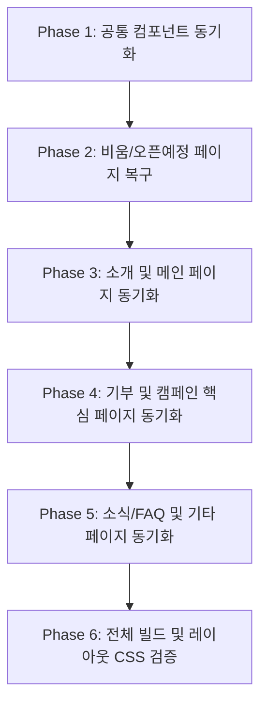

# 영문(EN) 웹페이지 국문 기준 레이아웃 및 구조 동기화 계획

국문 퍼블리싱 완료본을 기준으로 `en/` 폴더 내 영문 페이지 및 영문 공통 파일(`includes/*_en.html`)의 DOM 구조와 레이아웃을 1:1로 동기화합니다.
기존 영문 텍스트(카피)는 그대로 보존하고, 레이아웃 차이나 텍스트 길이에 따른 정렬 이슈는 CSS로 대응합니다.

---

## 사용자 확인 및 검토 사항 (User Review Required)

> [!IMPORTANT]
> **영문 텍스트 보존 원칙**
>
> - 기존 `en/` 파일에 이미 번역되어 있는 영문 문구는 임의로 수정하거나 국문으로 덮어쓰지 않고 100% 보존합니다.
> - 국문에서 새로 추가되어 영문 파일에 존재하지 않는 마크업/버튼/안내 문구의 경우, 자연스러운 영문 표기(또는 기획 상 정의된 영문 표기)를 적용합니다.

> [!NOTE]
> **CSS 대응 원칙**
>
> - 영문 텍스트의 특성(단어 길이, 대소문자, 줄바꿈)으로 인해 발생하는 레이아웃 틀어짐은 HTML 구조를 변경하지 않고 `src/css/*.css` (또는 필요 시 영문 전용 클래스/미디어쿼리)로 처리합니다.

---

## 주요 확인 및 결정 사항 (Open Questions)

> [!IMPORTANT]
> **1. `en/join/`, `en/login/`, `en/nonmember/` 디렉터리 정책**
> 현재 분석 결과, `en/join/`, `en/login/`, `en/nonmember/` 폴더 내 파일들은 초기 복사본 상태로 `<html lang="ko">`, `<load src="/includes/header.html" />` 및 국문 텍스트로 구성되어 있습니다.
>
> - **A안 (권장)**: 이 파일들도 구조를 최신 국문 기준으로 맞추고, `header_en.html` 로드 및 영문 텍스트로 번역/동기화 진행
> - **B안**: 회원가입/로그인은 국문 전용 기능으로 취급하여 영문에서는 제외하거나 국문 페이지로 리다이렉트
>   _(사용자 피드백 요청)_

> [!NOTE]
> **2. `en/donate/regular.html` 처리**
> 국문에서는 정기 후원이 `donate/one-time.html?tab=regular` 단일 페이지로 통합되었습니다.
>
> - `en/donate/regular.html`은 현재 빈 플레이스홀더 파일이므로, 국문과 동일하게 `en/donate/one-time.html?tab=regular`로 연결되도록 하고 해당 파일은 정리(또는 리다이렉트)할지 확인이 필요합니다.

---

## 분석 현황 요약 (Analysis Summary)

전체 40개 영문 관련 파일 대조 결과:

1. **공통 컴포넌트 (`includes/`)**:
   - `header_en.html` vs `header.html`: GNB 링크 주소(메인 루트 `/`, 탭 파라미터), 서브메뉴 순서 및 구조 동기화 필요
   - `footer_en.html` vs `footer.html`: 메인 로고 링크, 뉴스레터 영역, 푸터 링크 구조 동기화
   - 팝업류(`popups/*_en.html`): 마크업 구조 및 닫기/확인 버튼 동기화
2. **신규/레거시 비움 페이지 복구 (`en/houses/`)**:
   - `gangnam.html`, `inha.html`, `seocho.html`, `yeonhui.html` 4개 파일이 빈 플레이스홀더 상태임. 국문의 "오픈 예정(Coming Soon)" 마크업 구조로 전면 동기화 필요.
3. **대규모 구조 변경 페이지 (`en/donate/`)**:
   - `donate/one-time.html`: 국문은 1,015라인(아코디언, 해외카드 배너, 기부 탭, 약관 동의 등)으로 고도화되었으나 영문은 561라인 초기 형태임. 국문 구조에 맞춰 아코디언/폼 구조를 1:1 동기화하고 영문 텍스트 매핑 필요.
   - `donate/complete.html`: 국문 카드의 정보 레이아웃에 맞춰 구조 동기화.
4. **구조 보정 및 속성 동기화 페이지 (`about/`, `campaign/`, `faq/`, `news/`, `main/`)**:
   - `index.html` ↔ `en/main/main.html`: 메인 섹션 모션 데이터 속성, 이미지 경로, 버튼 클래스 동기화
   - `about/board.html`, `about/transparency.html`: 이사회 카드 그리드, 재정보고 테이블 구조 동기화
   - `campaign/family.html`, `campaign/gala_apply.html`: 신청 폼 필드 및 아코디언 동기화
   - `news/activity.html`, `news/notice.html`: 목록/상세 페이지 페이지네이션 및 카드 구조 동기화

---

## 단계별 실행 계획 (Proposed Changes)

---

### Phase 1: 공통 컴포넌트 동기화 (`includes/`)

GNB, 푸터, 공통 팝업의 마크업 구조 및 경로 동기화

#### [MODIFY] [header_en.html](file:///d:/rmhc/front_0624/includes/header_en.html)

- 국문 `header.html` 기준으로 서브메뉴 링크 및 순서(예: 기업 파트너, 이사회 등) 동기화
- 모바일 메뉴 패널 구조 및 버튼 클래스 일치
- 언어 전환 링크 `/` ↔ `/en/main/main.html` 정리

#### [MODIFY] [footer_en.html](file:///d:/rmhc/front_0624/includes/footer_en.html)

- 뉴스레터 입력 폼 구조 및 버튼 ID/클래스 국문과 1:1 일치
- 푸터 로고 링크 및 SNS/약관 링크 구조 동기화

#### [MODIFY] [popups](file:///d:/rmhc/front_0624/includes/popups)

- `dn_04p_en.html`, `house-inquiry-yangsan_en.html`, `newsletter_en.html` 구조 검증 및 국문 팝업 마크업과 일치화

---

### Phase 2: 하우스 오픈 예정 페이지 동기화 (`en/houses/`)

국문의 "오픈 예정(Coming Soon)" 레이아웃을 영문 페이지에 1:1 적용

#### [MODIFY] [gangnam.html](file:///d:/rmhc/front_0624/en/houses/gangnam.html)

#### [MODIFY] [inha.html](file:///d:/rmhc/front_0624/en/houses/inha.html)

#### [MODIFY] [seocho.html](file:///d:/rmhc/front_0624/en/houses/seocho.html)

#### [MODIFY] [yeonhui.html](file:///d:/rmhc/front_0624/en/houses/yeonhui.html)

- `house-coming-section`, `house-coming-badge`, `house-coming-title`, `house-coming-desc`, 하우스 카드 목록 구조 적용
- `<html lang="en">`, `<load src="/includes/header_en.html" />`, `<load src="/includes/footer_en.html" />` 적용
- "Coming Soon", "Ronald McDonald House: Gangnam" 등 영문 문구 적용

#### [MODIFY] [yangsan.html](file:///d:/rmhc/front_0624/en/houses/yangsan.html)

- 국문 `houses/yangsan.html`의 최근 변경점(탭, 모션 속성, 갤러리/룸 구조) 대조 적용

---

### Phase 3: 소개(`about/`) 및 메인(`main/`) 페이지 동기화

브랜드 소개 및 메인 페이지의 구조와 데이터 속성 일치

#### [MODIFY] [main.html](file:///d:/rmhc/front_0624/en/main/main.html)

- 국문 `index.html`과 섹션별 마크업(1~6 섹션, 스와이퍼, 비주얼 배너) 구조 1:1 일치
- 모션 속성(`data-motion`, `data-motion-delay`), 버튼 클래스 동기화

#### [MODIFY] [vision.html](file:///d:/rmhc/front_0624/en/about/vision.html)

#### [MODIFY] [greetings.html](file:///d:/rmhc/front_0624/en/about/greetings.html)

#### [MODIFY] [board.html](file:///d:/rmhc/front_0624/en/about/board.html)

- 국문 `about/board.html`의 이사회 프로필 카드 구조 동기화 (기존 영문 임원 소개 텍스트 유지)

#### [MODIFY] [partner.html](file:///d:/rmhc/front_0624/en/about/partner.html)

- 파트너사 로고 그리드 및 섹션 구조 국문과 일치

#### [MODIFY] [transparency.html](file:///d:/rmhc/front_0624/en/about/transparency.html)

- 재정보고 아코디언 및 연도별 탭, 표(table) 마크업 국문 구조와 1:1 일치

---

### Phase 4: 기부(`donate/`) 및 캠페인(`campaign/`) 페이지 동기화

가장 구조적 변화가 큰 기부 신청 폼과 캠페인 상세/신청서 동기화

#### [MODIFY] [one-time.html](file:///d:/rmhc/front_0624/en/donate/one-time.html)

- 국문 `donate/one-time.html`의 최신 아코디언 구조(단계별 폼, 금액 선택 버튼, 결제 수단 탭, 해외카드 배너, 이용약관 동의 등) 1:1 동기화
- 영문 텍스트 필드 및 해외 결제 안내 텍스트 매핑
- 영문 텍스트에 맞춘 레이아웃은 필요 시 `src/css/donate.css`에서 반응형 CSS 대응

#### [MODIFY] [complete.html](file:///d:/rmhc/front_0624/en/donate/complete.html)

- 기부 완료 안내 카드 및 버튼 구조 국문과 동기화

#### [MODIFY] [goods.html](file:///d:/rmhc/front_0624/en/donate/goods.html)

#### [MODIFY] [volunteer.html](file:///d:/rmhc/front_0624/en/donate/volunteer.html)

- 봉사활동 신청 절차 및 물품 후원 안내 구조 국문과 일치

#### [MODIFY] [family.html](file:///d:/rmhc/front_0624/en/campaign/family.html)

#### [MODIFY] [gala_apply.html](file:///d:/rmhc/front_0624/en/campaign/gala_apply.html)

#### [MODIFY] [gala.html](file:///d:/rmhc/front_0624/en/campaign/gala.html)

#### [MODIFY] [writing-contest.html](file:///d:/rmhc/front_0624/en/campaign/writing-contest.html)

#### [MODIFY] [kcr.html](file:///d:/rmhc/front_0624/en/campaign/kcr.html)

---

### Phase 5: 소식(`news/`), FAQ(`faq/`) 및 인증/회원 페이지 동기화

게시판 목록/상세 구조 및 부가 페이지 동기화

#### [MODIFY] [notice.html](file:///d:/rmhc/front_0624/en/news/notice.html) & [detail.html](file:///d:/rmhc/front_0624/en/news/notice/detail.html)

#### [MODIFY] [activity.html](file:///d:/rmhc/front_0624/en/news/activity.html) & [detail.html](file:///d:/rmhc/front_0624/en/news/activity/detail.html)

#### [MODIFY] [faq.html](file:///d:/rmhc/front_0624/en/faq/faq.html)

#### [MODIFY] [404.html](file:///d:/rmhc/front_0624/en/404.html)

#### [MODIFY] `en/login/`, `en/join/`, `en/nonmember/` (사용자 확인 후 확정 방식에 따라 적용)

---

### Phase 6: CSS 스타일 대응 및 빌드 무결성 검증

영문 전용 스타일 처리 및 빌드 테스트

#### [MODIFY] [common.css](file:///d:/rmhc/front_0624/src/css/common.css), [donate.css](file:///d:/rmhc/front_0624/src/css/donate.css), [about.css](file:///d:/rmhc/front_0624/src/css/about.css), etc.

- 영문 텍스트 줄바꿈(word-break), 폰트 사이즈 조정, 버튼 너비 맞춤 등 CSS 대응
- `html[lang="en"]` 또는 `.is-en` 선택자 활용을 통한 전용 스타일링 대응

---

## 검증 계획 (Verification Plan)

### 빌드 및 구문 자동 검증

- `npm run build` 실행: vite 롤업 빌드 및 HTML inject 정상 동작 여부 검증
- HTMLHint 또는 태그 일치성 검사 스크립트 실행하여 누락된 태그나 불일치 구조 확인

### 로컬 브라우저 UI 검증

- 로컬 개발 서버 (`http://localhost:5173/en/...`)에서 각 페이지별 화면 렌더링 확인:
  1. `http://localhost:5173/en/main/main.html`
  2. `http://localhost:5173/en/houses/gangnam.html` (오픈 예정 페이지 렌더링)
  3. `http://localhost:5173/en/donate/one-time.html` (기부 폼 및 반응형 레이아웃)
  4. `http://localhost:5173/en/about/transparency.html`
  5. PC / Tablet / Mobile 반응형 뷰포트에서 영문 텍스트 오버플로우나 깨짐 여부 확인
